# 09 - Diagramas de arquitectura, flujo y secuencia

## Propósito

Este documento reúne la vista arquitectónica y los diagramas de flujo y secuencia de los casos de uso principales actualmente soportados por **Grimorio Pathfinder**.

## Arquitectura global

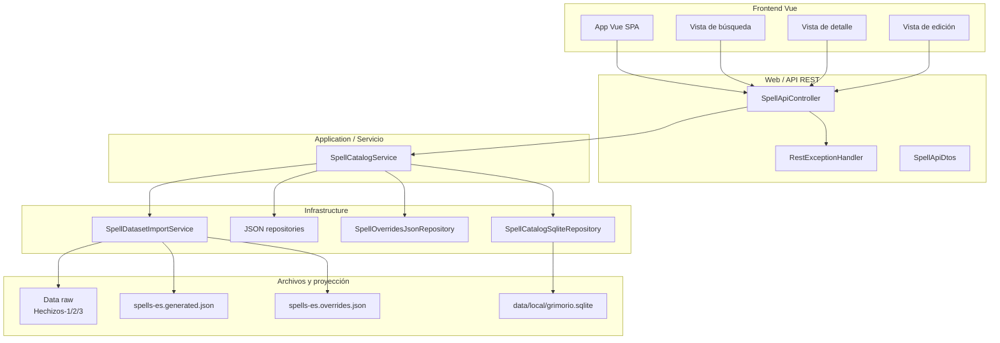

## Responsabilidades por capa

- **Frontend Vue**: muestra búsqueda, detalle y edición.
- **Web / API**: expone endpoints REST y traduce errores a `ProblemDetail`.
- **Service**: orquesta lectura, búsqueda, detalle y escritura de overrides.
- **Infrastructure**: importa JSON, compone el spell efectivo y reconstruye SQLite.
- **Data**: mantiene la fuente canónica versionada y la proyección local.

## Casos de uso cubiertos

1. Importar y reconstruir dataset
2. Listar listas de conjuros
3. Obtener niveles disponibles de una lista
4. Buscar conjuros
5. Ver detalle de conjuro
6. Editar campos españoles
7. Editar notas personales
8. Cambiar estado de traducción

---

## 1) Importar y reconstruir dataset

### Flujo

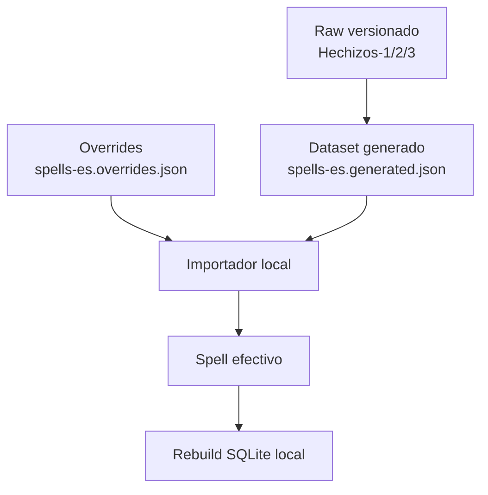

### Secuencia

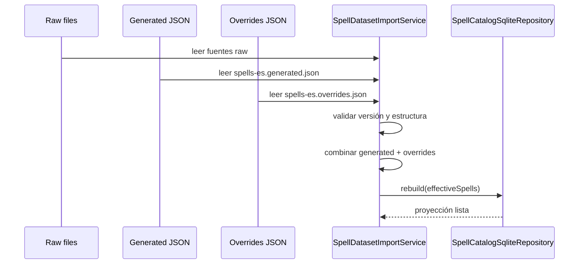

---

## 2) Listar listas de conjuros

### Flujo

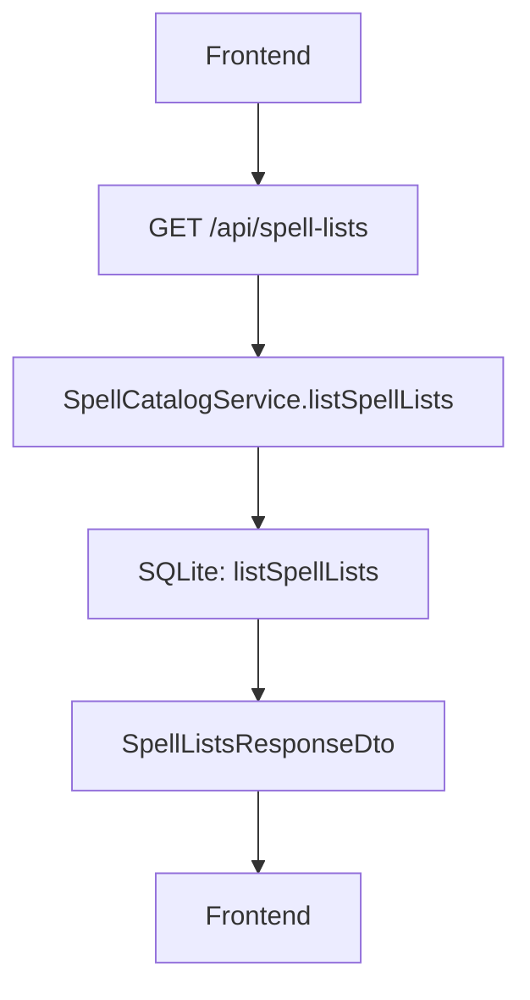

### Secuencia

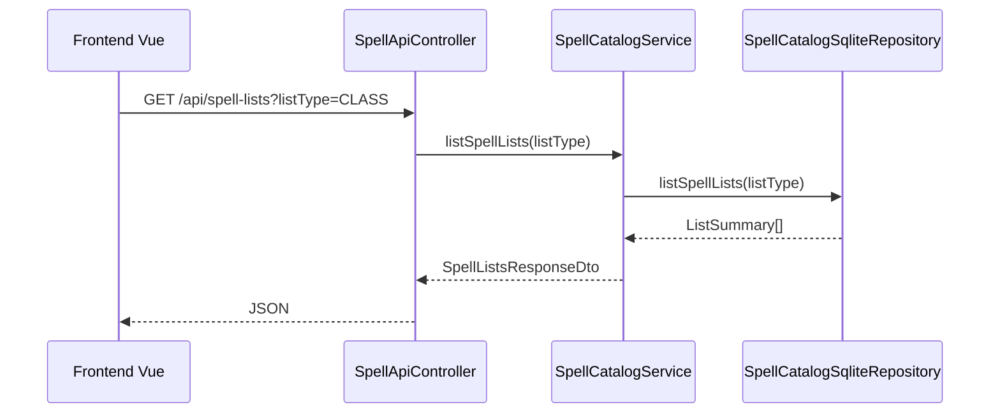

---

## 3) Obtener niveles disponibles de una lista

### Flujo

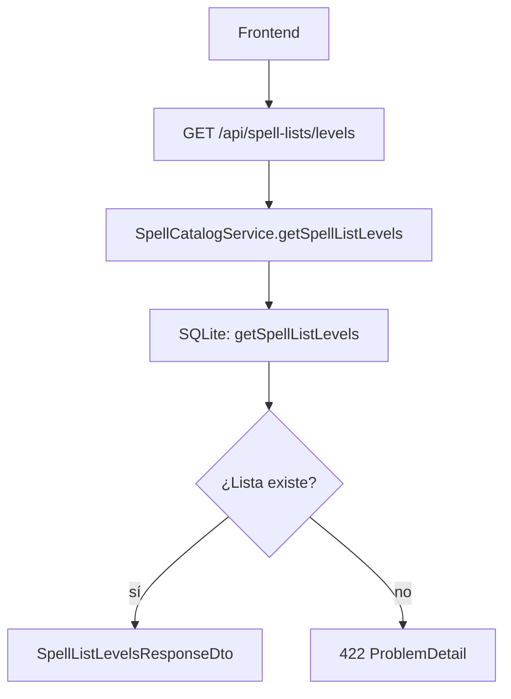

### Secuencia

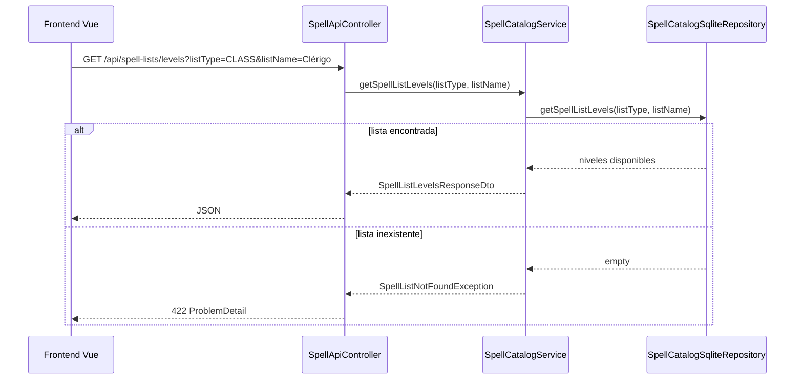

---

## 4) Buscar conjuros

### Flujo

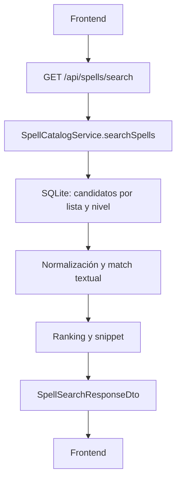

### Secuencia

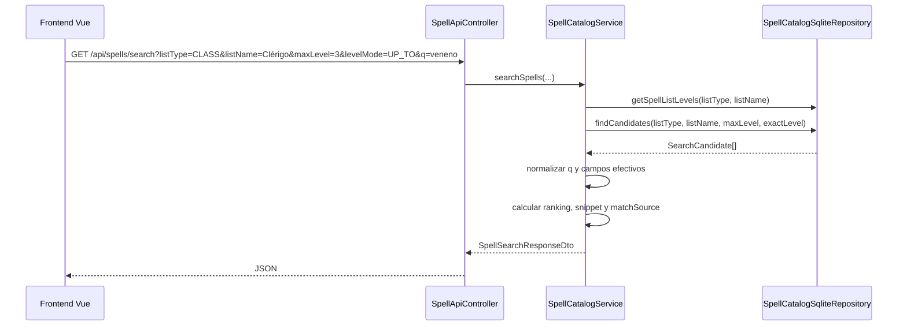

---

## 5) Ver detalle de conjuro

### Flujo

```mermaid
flowchart TD
  A[Frontend] --> B[GET /api/spells/{spellId}]
  B --> C[SpellCatalogService.getSpellDetail]
  C --> D[SQLite: findSpellById]
  D --> E[Detalle efectivo]
  E --> F[SpellDetailResponseDto]
  F --> G[Frontend]
```

### Secuencia

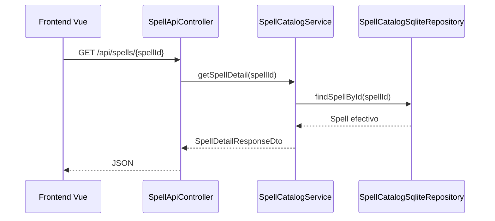

---

## 6) Editar campos españoles

### Flujo

```mermaid
flowchart TD
  A[Frontend edición] --> B[PATCH /api/spells/{spellId}/fields]
  B --> C[Validación de campos editables]
  C --> D[Leer override actual]
  D --> E[Merge de campos]
  E --> F[Actualizar translationStatus]
  F --> G[Escribir overrides]
  G --> H[Rebuild SQLite]
  H --> I[Detalle actualizado]
```

### Secuencia

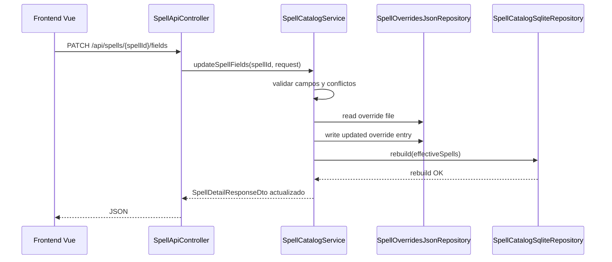

---

## 7) Editar notas personales

### Flujo

```mermaid
flowchart TD
  A[Frontend notas] --> B[PATCH /api/spells/{spellId}/notes]
  B --> C[Validación de personalNotes]
  C --> D[Leer override actual]
  D --> E[Actualizar personalNotes]
  E --> F[Escribir overrides]
  F --> G[Rebuild SQLite]
  G --> H[Detalle actualizado]
```

### Secuencia

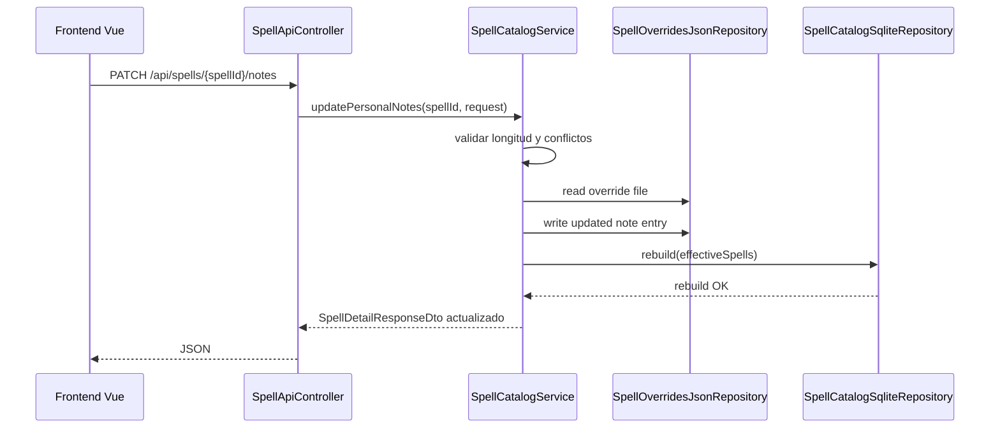

---

## 8) Cambiar estado de traducción

### Flujo

```mermaid
flowchart TD
  A[Frontend estado] --> B[PATCH /api/spells/{spellId}/translation-status]
  B --> C[Validar estado permitido]
  C --> D{¿LOCKED?}
  D -- sí --> E[Materializar campos editables actuales]
  D -- no --> F[Conservar merge de override]
  E --> G[Escribir overrides]
  F --> G
  G --> H[Rebuild SQLite]
  H --> I[Detalle actualizado]
```

### Secuencia

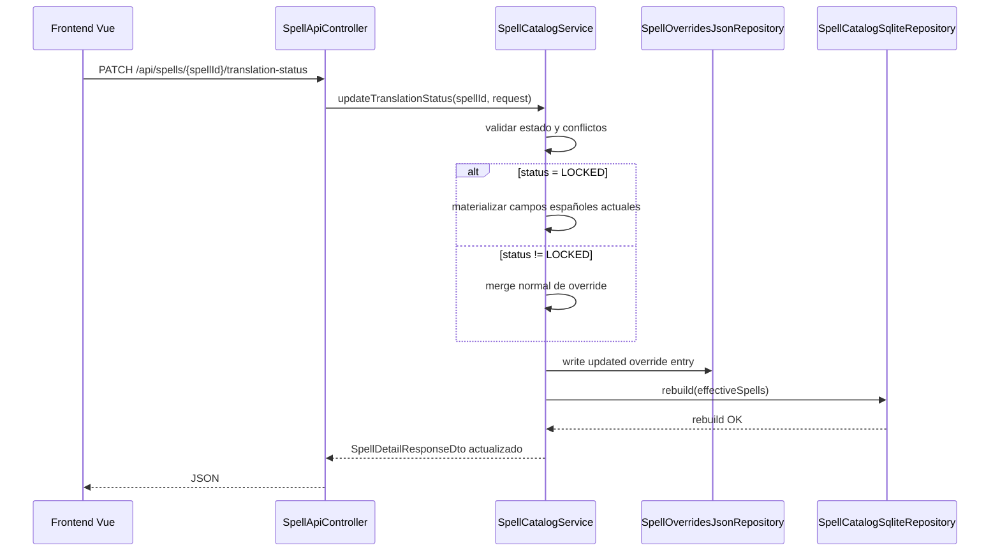

---

## 9) Manejo de errores

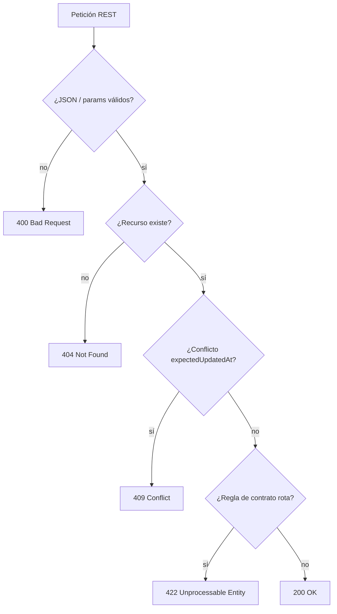

## Resumen

Estos diagramas reflejan el comportamiento actual de la aplicación:

- la fuente canónica vive en archivos versionados;
- SQLite es reconstruible;
- la API local expone lectura y edición;
- el frontend solo consume la API;
- las reglas de negocio viven en el servicio, no en la UI.
