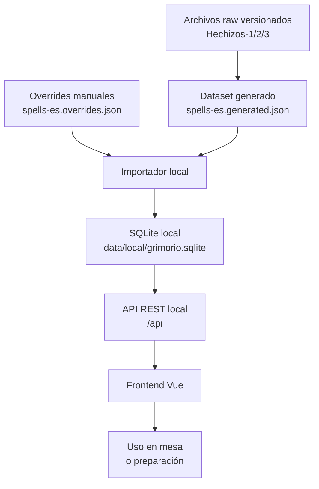
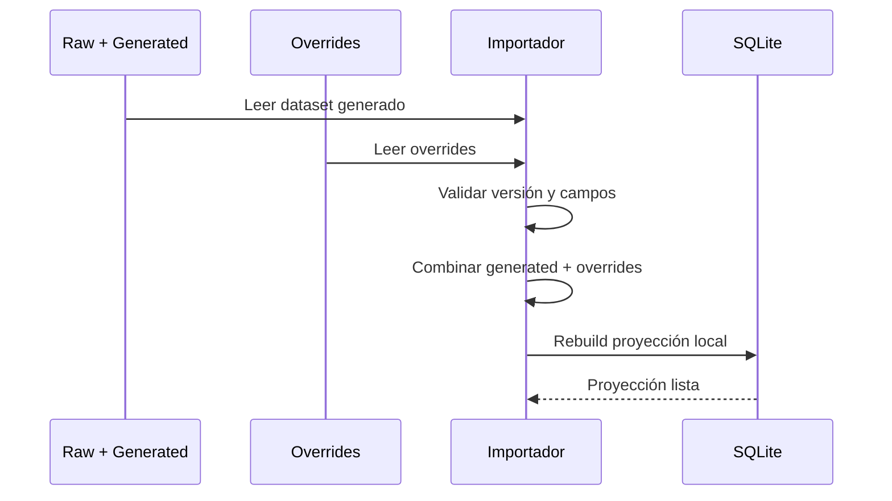
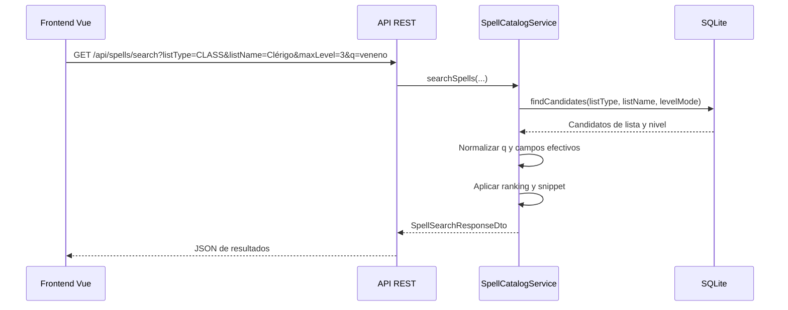
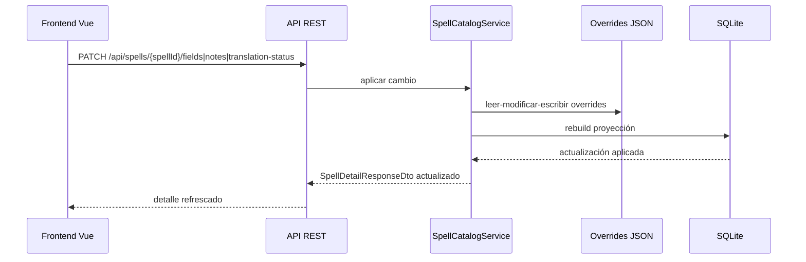
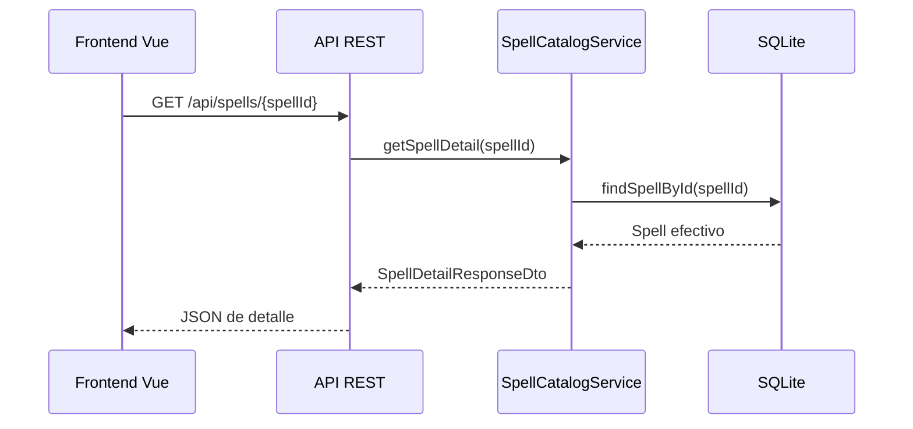

# 09 - Diagramas de flujo y secuencia

## Propósito

Este documento resume el flujo real de la aplicación con diagramas compactos para lectura rápida.

## Flujo general del producto

## Secuencia: importación y reconstrucción

## Secuencia: búsqueda principal

## Secuencia: edición de campos o notas

## Secuencia: detalle de conjuro

## Lectura rápida

- La fuente canónica vive en archivos versionados.
- SQLite es una proyección reconstruible.
- La API local no depende de internet.
- El frontend consume la API y no recalcula reglas de negocio.
